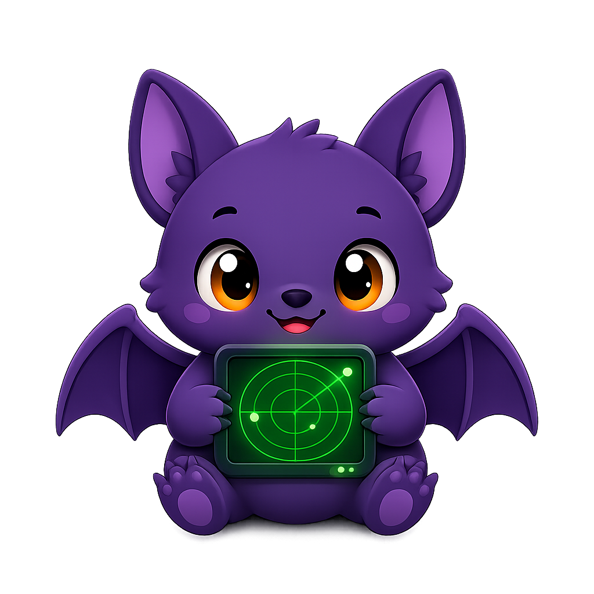
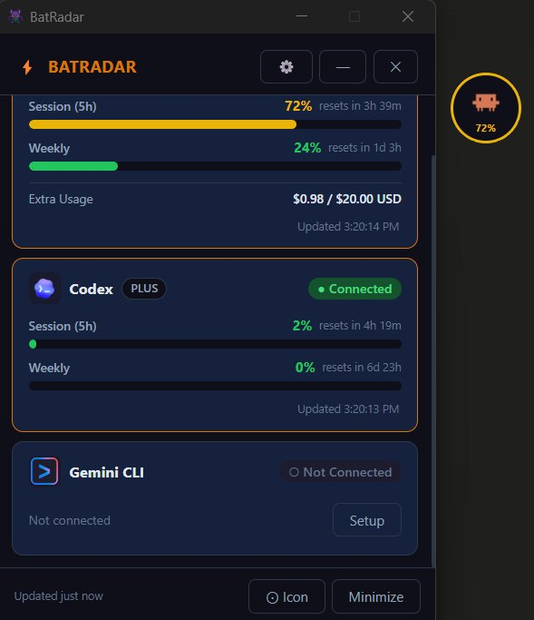
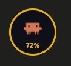
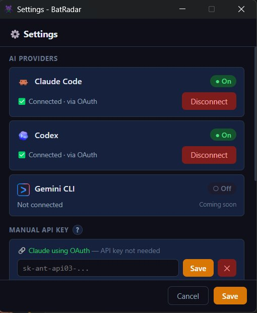
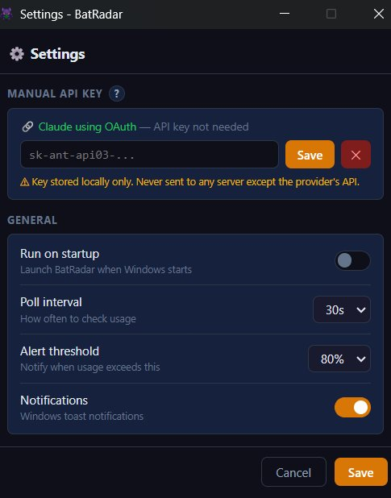

# BatRadar 🦇
<p align="center">
  
</p>
> Monitor your AI coding tool usage limits — Claude Code, Codex — from a floating desktop overlay.


---

## What is BatRadar?

BatRadar is a lightweight Windows desktop app that sits in your system tray and shows a small floating icon on screen. It automatically reads your Claude Code and Codex credentials and polls their usage APIs so you always know how much of your quota you've burned — without switching windows or opening a browser.

When usage gets high, it sends a Windows notification before you hit the limit.

---

## Screenshots

| Dashboard | Floating Icon |
|:---:|:---:|
|  |  |

| Settings — Providers | Settings — General |
|:---:|:---:|
|  |  |

---

## Download

Go to [**Releases**](https://github.com/ZenithHawking/BatRadar/releases) and download `BatRadar Setup x.x.x.exe`.

Run the installer — no configuration needed. BatRadar will appear in your system tray immediately.

---

## Features

- **Floating overlay** — a draggable circular icon that shows your highest current usage % and changes color as it rises
- **Dashboard** — click the icon to open a panel with per-provider usage bars (5h session, 7-day weekly, Opus/Sonnet breakdowns, extra credit spend)
- **Live polling** — auto-refreshes in the background with a configurable interval (default 30s), rate-limit safe
- **Alerts** — desktop notifications at warning (80%) and critical (95%) thresholds before you hit the wall
- **System tray** — runs quietly in the background, right-click to access dashboard or settings
- **Multi-provider** — Claude Code (OAuth or API key) + Codex (OAuth), Gemini CLI coming soon
- **Autostart** — optional Windows login startup

---

## Supported Providers

| Provider | Auth method | How to connect |
|---|---|---|
| **Claude Code** | OAuth (auto) | Run `claude login` in terminal |
| **Claude Code** | API Key | Enter key in Settings → Manual API Key |
| **Codex** | OAuth (auto) | Run `npm i -g @openai/codex` then `codex` |
| **Gemini CLI** | — | Coming soon |

BatRadar reads credentials directly from the files Claude Code and Codex create on your machine — no re-login required if you're already signed in.

---

## Usage Metrics Shown

**Claude Code**
- Session usage (5-hour window)
- Weekly usage (7-day window)
- Weekly Sonnet / Opus breakdowns
- Extra usage credit spend

**Codex**
- Session usage (primary window)
- Weekly usage (secondary window)
- Credit balance

---

## Settings

| Setting | Default | Description |
|---|---|---|
| Poll interval | 30s | How often to refresh usage data |
| Alert threshold | 80% | Warning notification trigger |
| Critical threshold | 95% | Critical notification trigger |
| Autostart | Off | Launch BatRadar when Windows starts |
| Notifications | On | Toggle desktop alerts |

---

## Running from Source

Requires **Node.js 18+**.

```bash
git clone https://github.com/ZenithHawking/BatRadar.git
cd BatRadar
npm install
npm start
```

### Build installer

```bash
npm run build
# Output: dist/BatRadar Setup x.x.x.exe
```

---

## Project Structure

```
BatRadar/
├── main.js              # Electron main process — windows, tray, polling, IPC
├── preload.js           # Context bridge (renderer ↔ main)
├── src/
│   ├── index.html       # Dashboard window
│   ├── floating.html    # Floating overlay window
│   ├── settings.html    # Settings window
│   ├── js/
│   │   ├── dashboard.js # Dashboard UI logic
│   │   ├── floating.js  # Overlay drag & display logic
│   │   ├── settings.js  # Settings form & provider management
│   │   └── utils.js     # Shared helpers
│   ├── css/             # Per-window stylesheets
│   └── assets/icons/    # Provider icons, tray icon, app icon
└── screenshots/         # App screenshots for README
```

---

## How It Works

1. On startup, BatRadar reads your existing credential files (`~/.claude/.credentials.json`, `~/.codex/auth.json`) — nothing is stored by this app except your settings and an optional encrypted API key in `%APPDATA%/batradar/`
2. It polls the provider APIs in the background on your configured interval
3. Usage data is broadcast to all open windows (dashboard, overlay, settings) in real time
4. If usage crosses a threshold, a Windows notification fires — once per usage window, not on every poll

---

## Privacy

- All data stays on your machine
- No analytics or telemetry
- API keys stored locally with base64 encoding
- Credentials are only sent to the respective provider APIs (Anthropic, OpenAI)

---

## Release a New Version

```bash
# Bump version in package.json, then:
git tag v0.2.0
git push origin v0.2.0
```

GitHub Actions will build the installer and publish a release automatically.

---

## License

MIT
