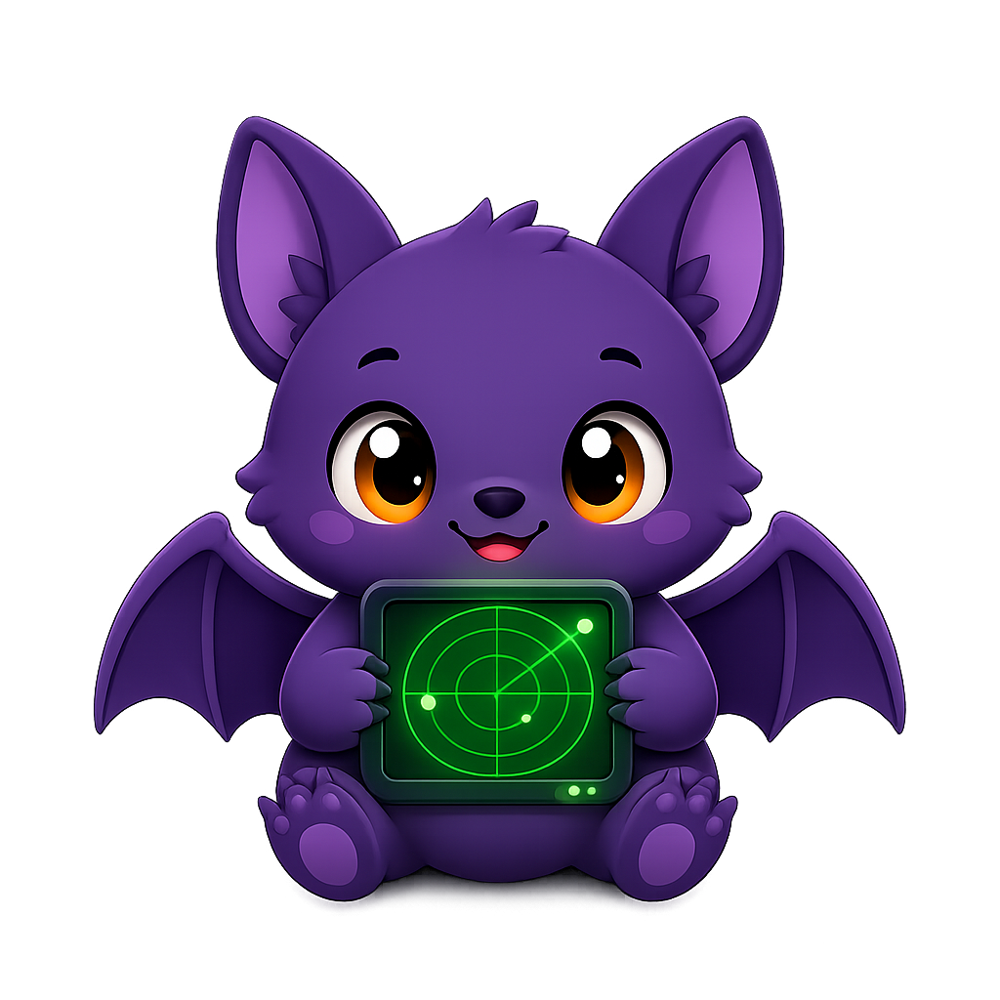
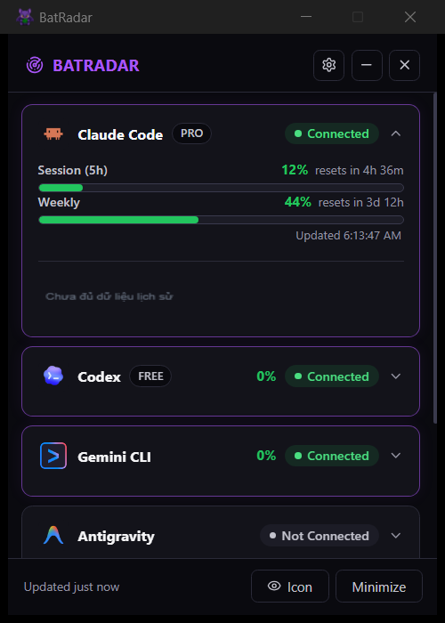
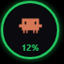
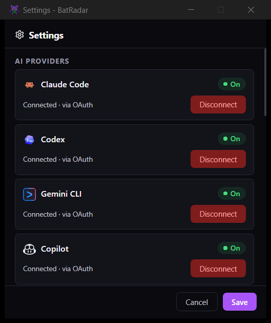
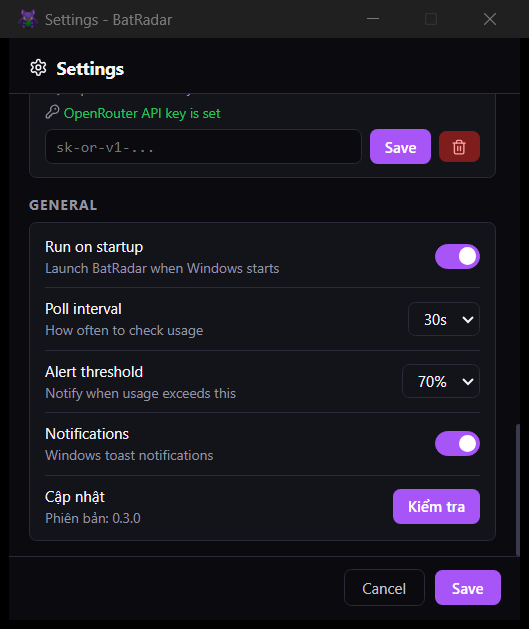

# BatRadar 🦇

> Monitor your AI coding tool usage limits — Claude Code, Codex, Gemini CLI, Copilot, OpenRouter, Antigravity — from a floating desktop overlay.


<p align="center">
  
</p>

---

## What is BatRadar?

BatRadar is a lightweight Windows desktop app that sits in your system tray and shows a small floating icon on screen. It automatically reads your existing credentials for Claude Code, Codex, Gemini CLI, Copilot, OpenRouter and Antigravity, and polls their usage APIs so you always know how much of your quota you've burned — without switching windows or opening a browser.

When usage gets high, it sends a Windows notification before you hit the limit.

---

## Screenshots

| Dashboard | Floating Icon |
|:---:|:---:|
|  |  |

| Settings — Providers | Settings — General |
|:---:|:---:|
|  |  |

---

## Download

Go to [**Releases**](https://github.com/ZenithHawking/BatRadar/releases) and download `BatRadar Setup x.x.x.exe`.

Run the installer — no configuration needed. BatRadar will appear in your system tray immediately.

---

## Features

- **Floating overlay** — a draggable circular icon that shows your highest current usage % and pulses a radar-style glow that speeds up and reddens as you approach the limit
- **Dashboard** — click the icon to open a panel with per-provider usage bars (5h session, 7-day weekly, Opus/Sonnet breakdowns, extra credit spend); cards are collapsible and can be reordered by drag-and-drop
- **Usage history** *(Tauri build)* — a sparkline chart per provider built from a lightweight local log, so you can see burn-rate over the last 30 days
- **Live polling** — auto-refreshes in the background with a configurable interval (default 30s), rate-limit safe
- **Alerts** — desktop notifications at warning (80%) and critical (95%) thresholds before you hit the wall
- **System tray** — runs quietly in the background, right-click to access dashboard or settings
- **Multi-provider** — Claude Code, Codex, Gemini CLI, GitHub Copilot, Antigravity (auto-detect) + OpenRouter (API key)
- **Autostart** — optional Windows login startup

---

## Supported Providers

| Provider | Auth method | How to connect |
|---|---|---|
| **Claude Code** | OAuth (auto) | Run `claude login` in terminal |
| **Claude Code** | API Key | Enter key in Settings → Manual API Key |
| **Codex** | OAuth (auto) | Run `npm i -g @openai/codex` then `codex` |
| **Gemini CLI** | OAuth (auto) | Run `npm i -g @google/gemini-cli` then `gemini` |
| **Copilot** | GitHub token (auto) | Login Copilot in VS Code/JetBrains, or `gh auth login` |
| **OpenRouter** | API Key | Create a free key at openrouter.ai/keys, enter in Settings |
| **Antigravity** | Local app (auto) | Install from antigravity.google, login, keep the app open |

BatRadar reads credentials directly from the files these tools create on your machine — no re-login required if you're already signed in.

---

## Building from source

Two runtimes live in this repo while the Tauri migration is in progress. The
renderer under `src/` is shared — `src/js/utils.js` detects which runtime it is
running under, so the same HTML/CSS/JS serves both.

| | Electron (`main.js`) | Tauri (`src-tauri/`) |
|---|---|---|
| Build | `npm run build` | `npx @tauri-apps/cli@2 build` |
| Installer size | ~84 MB | ~4.5 MB |
| Requires | Node | Node + Rust toolchain + MSVC build tools |

The Tauri build has an auto-updater wired up (`tauri-plugin-updater`, signed
releases) but it isn't in the GitHub Actions release pipeline yet — published
releases are still the Electron build. Everything else — all six providers,
tray, alerts, floating overlay, autostart, single-instance — is at parity
with the Electron build, plus a usage-history sparkline that Electron doesn't
have (no equivalent IPC command wired there).

---

## Usage Metrics Shown

**Claude Code**
- Session usage (5-hour window)
- Weekly usage (7-day window)
- Weekly Sonnet / Opus breakdowns
- Extra usage credit spend

**Codex**
- Session usage (primary window)
- Weekly usage (secondary window)
- Credit balance

---

## Settings

| Setting | Default | Description |
|---|---|---|
| Poll interval | 30s | How often to refresh usage data |
| Alert threshold | 80% | Warning notification trigger |
| Critical threshold | 95% | Critical notification trigger |
| Autostart | Off | Launch BatRadar when Windows starts |
| Notifications | On | Toggle desktop alerts |

---

## Running from Source

Requires **Node.js 18+**.

```bash
git clone https://github.com/ZenithHawking/BatRadar.git
cd BatRadar
npm install
npm start
```

### Build installer

```bash
npm run build
# Output: dist/BatRadar Setup x.x.x.exe
```

---

## Project Structure

```
BatRadar/
├── main.js              # Electron main process — windows, tray, polling, IPC
├── preload.js           # Context bridge (renderer ↔ main)
├── src/
│   ├── index.html       # Dashboard window
│   ├── floating.html    # Floating overlay window
│   ├── settings.html    # Settings window
│   ├── js/
│   │   ├── dashboard.js # Dashboard UI logic
│   │   ├── floating.js  # Overlay drag & display logic
│   │   ├── settings.js  # Settings form & provider management
│   │   └── utils.js     # Shared helpers
│   ├── css/             # Per-window stylesheets
│   └── assets/icons/    # Provider icons, tray icon, app icon
├── src-tauri/            # Tauri backend (windows, tray, polling, IPC, history log) — in progress
└── screenshots/         # App screenshots for README
```

---

## How It Works

1. On startup, BatRadar reads your existing credential files (`~/.claude/.credentials.json`, `~/.codex/auth.json`) — nothing is stored by this app except your settings and an optional encrypted API key in `%APPDATA%/batradar/`
2. It polls the provider APIs in the background on your configured interval
3. Usage data is broadcast to all open windows (dashboard, overlay, settings) in real time
4. If usage crosses a threshold, a Windows notification fires — once per usage window, not on every poll

---

## Privacy

- All data stays on your machine
- No analytics or telemetry
- API keys stored locally with base64 encoding
- Credentials are only sent to the respective provider APIs (Anthropic, OpenAI)

---

## Release a New Version

```bash
# Bump version in package.json, then:
git tag v0.3.0
git push origin v0.3.0
```

GitHub Actions will build the installer and publish a release automatically.

---

## License

MIT
